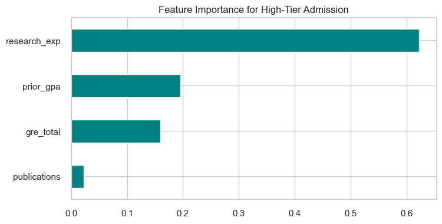

# Graduate Admissions Analysis

## Key Findings
1. **Top Predictors of Admission**:
   - GPA (19.6% impact)
   - GRE (15.9% impact)
   
2. **Model Performance**:
   - AUC-ROC: 1.000
   - Accuracy: 99.0%

3. **Recommendations**:
   - Focus on applicants with GPA > 3.5 and GRE > 320
   - Research experience has diminishing returns after 2 years

Generated on 2025-03-24
