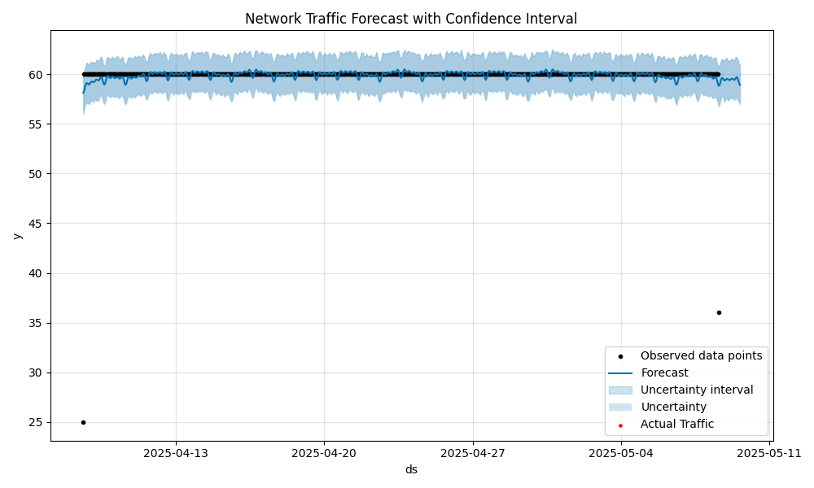

# Telecom Network Performance Analyzer

## Project Structure
```
tree -L 2
```

## How to Run
1. Generate synthetic data:
```bash
jupyter notebook notebooks/1_data_generation.ipynb
```
2. Run analyses:
```bash
jupyter notebook notebooks/2_geospatial_analysis.ipynb
jupyter notebook notebooks/3_time_series_prediction.ipynb
```

## Sample Output
